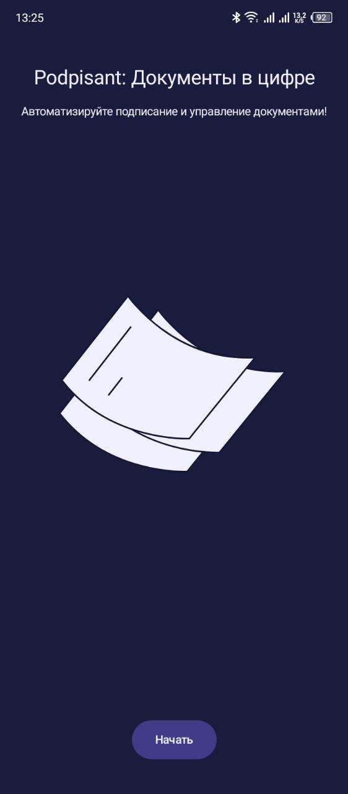
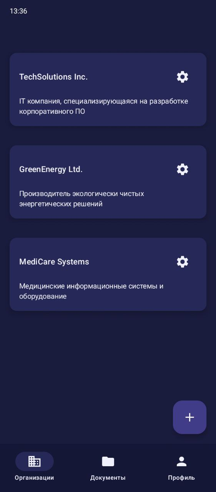
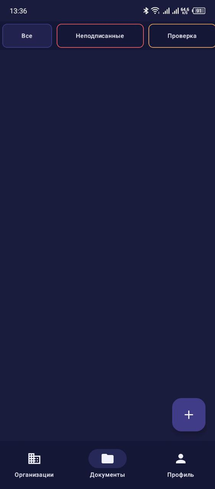
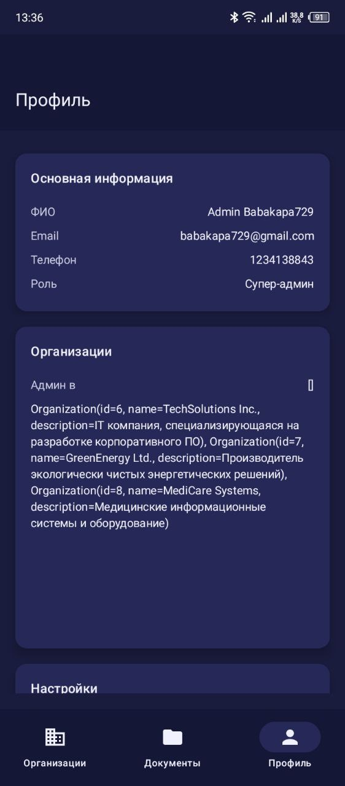

# Сервис для рассылки и подписания документов

## Оглавление
- [Описание](#описание)
- [Скриншоты](#скриншоты)
- [Используемые технологии](#используемые-технологии)
- [Установка](#установка)
- [Портфолио](#портфолио)

## Описание
**Сервис для рассылки и подписания документов** представляет собой мобильное приложение, разработанное с использованием **Jetpack Compose**, которое помогает компаниям автоматизировать процесс подписания и рассылки документов между сотрудниками. Приложение позволяет сотрудникам подписывать документы с использованием номера телефона, а также отправлять документы на подписание другим сотрудникам компании. Включена гибкая ролевая система и возможность уведомлений через почту, SMS или мессенджеры.

### Основные функции:
1. Авторизация пользователя через OTP.
2. Регистрация и создание предприятия с отделами.
3. Настройка ролевой системы для сотрудников.
4. Отправка документов на подписание сотрудникам с распределением на этапы и статусы подписания.
5. Подтверждение подписания.
6. Шифрование чувствительных данных.
7. 
## Скриншоты

  
  
  
  
  
  
  

## Используемые технологии
| Технология                    | Описание                                                                  |
|-------------------------------|---------------------------------------------------------------------------|
| **Jetpack Compose**           | Фреймворк для создания пользовательского интерфейса на Android            |
| **OkHttp + Retrofit**         | HTTP-клиент для запросов и получения данных от сервера                    |
| **Dagger - Hilt**             | Внедрение зависимостей для управления зависимостями в приложении          |
| **Spotless + GitHub Actions** | Автоматическая проверка кода при pull реквесте                            |
| **Clean Architecture + MVVM** | Архитектурный шаблон для организации чистой и масштабируемой кодовой базы |

## Установка

  

Или скачать по ссылке на <a href="https://www.rustore.ru/catalog/app/bob.colbaskin.iubip_spring2025">RuStore</a>

## Портфолио
Для более подробного ознакомления с проектом и другими моими работами, вы можете посетить мое портфолио на [Behance](https://www.behance.net/gallery/222004489/Android-Developer-Portfolio).